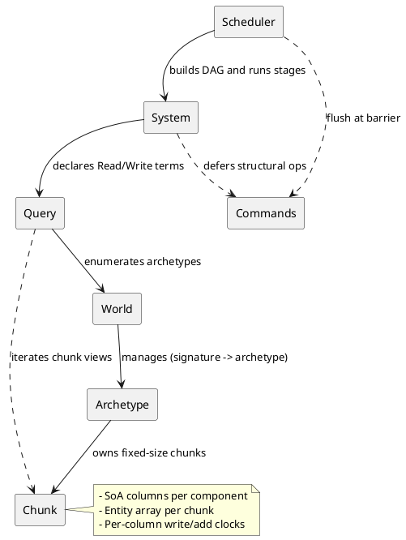
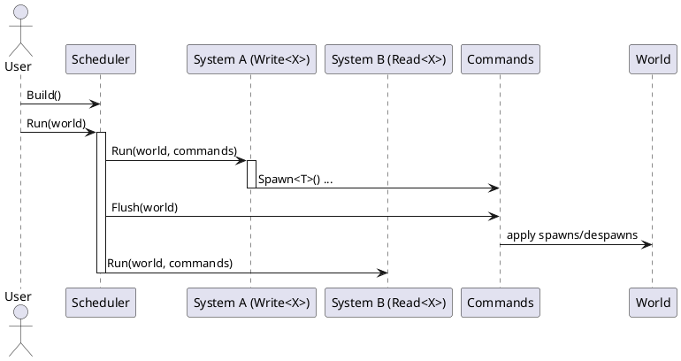

# NGIN.ECS

High‑performance, data‑oriented Entity Component System (ECS) for C++23. NGIN.ECS stores your data in cache‑friendly columns (SoA), groups entities that share the same components (archetypes), and runs your game/engine logic (systems) deterministically and safely.

If you’re new to ECS or data‑oriented design, this README walks you through the key ideas step‑by‑step with examples and diagrams.

— Built to integrate with `NGIN::Base`. Mirrors its build/test style and naming conventions.

## Table of Contents

1. What and Why
2. Core Concepts (plain English)
3. Quick Start (10 lines to moving entities)
4. Step‑By‑Step Tutorial (entities → queries → systems)
5. How Storage Works (Archetypes + Chunks)
6. Scheduling & Determinism (Why it’s safe without locks)
7. Structural Changes with Commands (Deferred but easy)
8. Change Detection (Added/Changed using epochs)
9. Examples (build & run)
10. Build & Install (CMake presets)
11. API Overview (where to look in the headers)
12. Architecture Diagrams (PlantUML)
13. Limitations & Roadmap
14. FAQ
15. Contributing & License

## 1) What and Why

- ECS breaks your app into:
  - Entities: lightweight IDs for “things”.
  - Components: plain data attached to entities (position, velocity, health...).
  - Systems: functions that process entities with certain components.
- Why this ECS?
  - Performance: SoA layout keeps hot data contiguous for the CPU cache.
  - Predictability: systems declare what they read/write → the scheduler runs them in a conflict‑free order.
  - Simplicity: no runtime locks in hot paths; structural changes are deferred in `Commands` and applied at barriers.

## 2) Core Concepts (plain English)

- Entity: a 64‑bit ID. It’s just a handle; data lives in components.
- Component: a struct of data (e.g. `struct Transform { float x,y,z; };`).
- Archetype: a group of entities that have the exact same set of components. Stored in SoA “columns”.
- Chunk: a small block of storage (e.g. 64 KB) inside an archetype. Holds many entities worth of columns.
- Query: “give me chunks that have components X and Y (but not Z)”. Iterates chunks for maximal locality.
- System: a function that runs queries. It declares what it reads/writes so the scheduler can order systems safely.
- Commands: a “to‑do list” for structural changes (spawn, despawn, add/remove components). Applied at stage barriers.
- Epoch: a frame/phase counter. We track what was Added/Changed “in this epoch” for change‑driven systems.

## 3) Quick Start (10 lines to moving entities)

```cpp
#include <NGIN/ECS/World.hpp>
#include <NGIN/ECS/Query.hpp>

struct Transform { float x, y, z; };
struct Velocity  { float vx, vy, vz; };

NGIN::ECS::World world;
for (int i = 0; i < 1000; ++i)
  (void)world.Spawn(Transform{float(i),0,0}, Velocity{1,2,3});

NGIN::ECS::Query<NGIN::ECS::Write<Transform>, NGIN::ECS::Read<Velocity>> q{world};
q.for_chunks([&](const NGIN::ECS::ChunkView& chunk){
  auto*       t = chunk.write<Transform>();
  const auto* v = chunk.read<Velocity>();
  for (auto i = chunk.begin(); i < chunk.end(); ++i) t[i].x += v[i].vx;
});
```

You just:
- Spawned entities with `Transform` and `Velocity`.
- Built a query that Writes `Transform` and Reads `Velocity`.
- Iterated by chunk for cache‑friendly updates.

## 4) Step‑By‑Step Tutorial

1. Define your components:
   ```cpp
   struct Transform { float x, y, z; };
   struct Velocity  { float vx, vy, vz; };
   struct PlayerTag {};
   ```
2. Spawn entities (typed API chooses the right archetype automatically):
   ```cpp
   World world;
   auto e = world.Spawn(Transform{0,0,0}, Velocity{1,0,0}, PlayerTag{});
   ```
3. Process in systems/queries:
   ```cpp
   Query<Write<Transform>, Read<Velocity>, With<PlayerTag>> q{world};
   q.for_chunks([&](const ChunkView& c){
     auto* t = c.write<Transform>();
     auto* v = c.read<Velocity>();
     for (auto i=c.begin(); i<c.end(); ++i) t[i].x += v[i].vx;
   });
   ```
4. Defer spawns/despawns with Commands and flush at a barrier:
   ```cpp
   Scheduler sched;
   auto spawn = MakeSystem<Write<PlayerTag>>("Spawn", [](World&, Commands& cmd){ cmd.Spawn(PlayerTag{}); });
   auto read  = MakeSystem<Read<PlayerTag>>("Read",  [](World& w, Commands&){ Query<Read<PlayerTag>> q{w}; /*...*/ });
   sched.Register(spawn); sched.Register(read);
   sched.Build();
   sched.Run(world); // flushes Commands between stages
   ```

## 5) How Storage Works (Archetypes + Chunks)

- An archetype is the set of component types. Each archetype has many chunks.
- Chunks are fixed‑size blocks (default 64 KB). Each component is a column (SoA array) inside the chunk.
- Adding/removing a component moves the entity between archetypes (fast `memcpy` per column in batches — coming in the next phase).

Why SoA? Iterating `Transform` and `Velocity` in tight loops reads contiguous arrays, which is cache‑friendly and fast.

## 6) Scheduling & Determinism (Why it’s safe without locks)

- Each system declares the components/resources it reads or writes.
- The scheduler builds a dependency graph:
  - Write vs Read or Write vs Write on the same type → add an edge.
- Systems run in stages so they never conflict. Within a stage, work can be parallelised by chunk (future work).
- Same inputs → same execution order → deterministic results.

## 7) Structural Changes with Commands (Deferred but easy)

- Systems shouldn’t modify archetype layouts mid‑iteration (that would cause data to move under your feet).
- Instead, record ops in `Commands`:
  - `cmd.Spawn<Ts...>(values...)`
  - `cmd.Despawn(entity)`
  - (Planned) `cmd.Add<T>`, `cmd.Remove<T>`, `cmd.Set<T>`
- Commands are applied all at once at a barrier (between scheduler stages).

## 8) Change Detection (Added/Changed using epochs)

- The world has an epoch counter (think: “frame id”).
- Each chunk keeps a per‑column “write” and “add” clock stamped with the current epoch.
- Queries can filter by:
  - `Added<T>`: matched this epoch (chunk contains T added in current epoch).
  - `Changed<T>`: written this epoch (query with `Write<T>` marks the chunk’s write clock).
- Advance with `world.NextEpoch()` when you want change filters to reset.

## 9) Examples

Two buildable examples live under `examples/`:

- `QuickStart`: spawns entities, runs a move query, and demonstrates scheduler barrier flush.
- `ChangeDetection`: demonstrates `Added<T>`/`Changed<T>` filters and epoch advancement.

Build & run:

```
cmake --preset examples
cmake --build --preset examples-debug -j
./build/examples/examples/QuickStart/Debug/ECSQuickStart
./build/examples/examples/ChangeDetection/Debug/ECSChangeDetection
```

## 10) Build & Install (CMake presets)

Presets use Ninja Multi‑Config. Requirements: C++23 compiler and `NGIN::Base` available (package, sibling checkout, or `NGIN_BASE_SOURCE_DIR`).

```
# Library only (tests OFF)
cmake --preset development
cmake --build --preset development-debug -j

# With tests
cmake --preset tests
cmake --build --preset tests-debug -j
ctest --test-dir build/tests --output-on-failure -C Debug

# Examples
cmake --preset examples
cmake --build --preset examples-debug -j

# Install (to out/install by default)
cmake --preset install
cmake --build --preset install-release
```

Key options:
- `NGIN_ECS_BUILD_TESTS` (ON/OFF)
- `NGIN_ECS_BUILD_EXAMPLES` (ON/OFF)

## 11) API Overview (map to headers)

- Entities → `include/NGIN/ECS/Entity.hpp`
- Types → `include/NGIN/ECS/TypeRegistry.hpp`
- Storage → `include/NGIN/ECS/Archetype.hpp`
- World → `include/NGIN/ECS/World.hpp`
- Queries → `include/NGIN/ECS/Query.hpp`
- Commands → `include/NGIN/ECS/Commands.hpp`
- Scheduler → `include/NGIN/ECS/Scheduler.hpp`

## 12) Architecture Diagrams (PlantUML)

Component view:



Stage/barrier sequence:



## 13) Current Limitations & Roadmap

Current limitations (MVP):
- Scheduler executes single‑threaded.
- Despawn only retires entity IDs; physical removal/backfill is not yet implemented.
- Optional/partial access (`Opt<T>`) does not yet affect matching.
- Version clocks are chunk‑level; no per‑row dirty masks yet.

Roadmap:
1. Parallel job system: chunk sharding, work‑stealing pool, deterministic sharding order.
2. Command buffers v2: lock‑free MPSC per worker, batched moves, add/remove/set ops.
3. Events & messaging: typed MPMC channels, double‑buffered per frame.
4. Snapshots & rendering view: publish read‑only snapshot at frame end; render reads N+1.
5. Transforms & hierarchy: dirty graph with parallel subtree updates.
6. Serialization & hot reload: schema registry, deltas via version clocks, migration hooks.
7. Tooling & observability: inspector, profiler hooks, validation mode, trace recorder.

## 14) FAQ

- “Can I add or remove a component at runtime?”
  - Yes — via Commands in the upcoming phase. MVP includes spawn/despawn; add/remove/set follows soon.
- “What about non‑POD components (std::string, std::vector)?”
  - Planned via a blob/arena with stable handles and optional serializers.
- “How do I render safely from another thread?”
  - Planned snapshots: the sim writes to world; a read‑only snapshot is published at frame end for the render thread.
- “Is execution deterministic?”
  - Yes, with a stable DAG order and stable chunk ordering. Reductions should be associative/commutative or ordered.

## 15) Contributing & License

- Tests use Boost.UT with case discovery via CTest (`tests/`).
- Style follows NGIN.Base conventions. Public headers are under `include/NGIN/ECS/`.
- Please keep PRs focused and add tests.

This project is licensed under the license in `LICENSE` (same as other NGIN family repos).
